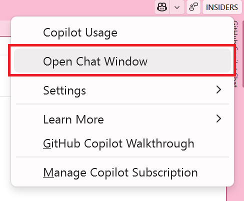

# Parte 00: Explorando o Código com GitHub Copilot Chat

O GitHub Copilot Chat permite que você faça perguntas sobre seu código e receba respostas inteligentes.

1. [] Abra a solução no Visual Studio 2026, se ainda não estiver aberta.
1. Clique no GitHub Copilot Chat no canto superior direito do Visual Studio e selecione **Open Chat Window** ou pressione `Ctrl+\+C` se o chat do Copilot não estiver aberto.
   
1. [] Certifique-se de que você está no modo **Ask** clicando na aba **Ask** na parte inferior da janela de chat.
   
1. [] Tente fazer perguntas sobre a estrutura do projeto:
   - `What projects are in this solution and how do things work together?`
   - `How does the Products API work?`
1. [] Observe como o Copilot analisa seu código para fornecer respostas contextuais.

**Conclusão Principal**: O GitHub Copilot Chat ajuda você a entender bases de código desconhecidas, respondendo perguntas sobre a estrutura do projeto, arquitetura e detalhes de implementação.

---

[Próximo: Parte 01 - Completação de Código com Ghost Text](./part01-code-completion.md)
