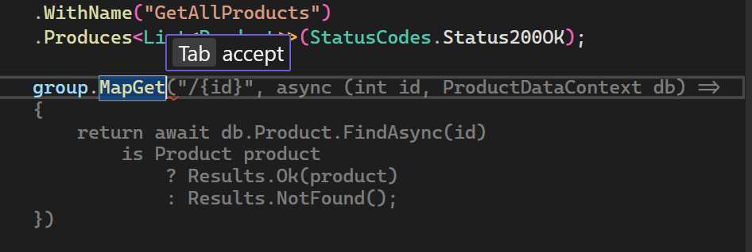
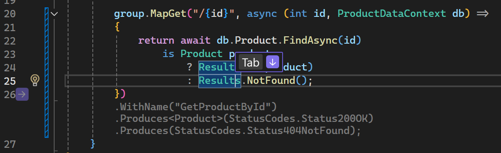
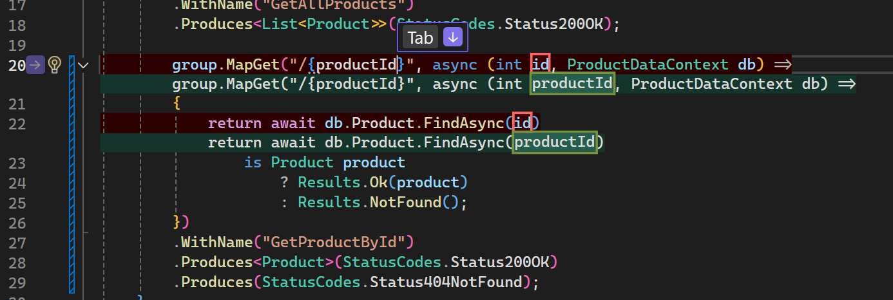
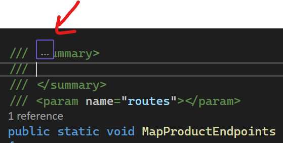

# Parte 01: Completação de Código com Ghost Text

Nesta seção, você usará a completação de código do GitHub Copilot para implementar endpoints de API.

> IMPORTANTE: Para este exercício, **NÃO** copie e cole o trecho de código fornecido, mas sim o digite manualmente. Isso permitirá que você experiencie a completação de código como faria ao programar no seu dia a dia. Você provavelmente verá que precisa digitar apenas alguns caracteres antes que o GitHub Copilot comece a sugerir o restante.

1. [] Pare a depuração do aplicativo se estiver em execução.


1. [] No Solution Explorer, no projeto **Products**, abra **Endpoints/ProductEndpoints.cs** — ele terá um único endpoint implementado.

   > Nota: O GitHub Copilot não fornecerá sugestões de código durante a depuração.
   
1. [] Vamos implementar um novo **MapGet** para obter detalhes de um produto por **id**. Mova o cursor e clique na linha 20, abaixo do endpoint **/** existente. Uma sugestão pode aparecer ou digite:
   ```csharp
   g
   ```
1. [] Aguarde as sugestões do ghost text aparecerem (texto cinza).
;
   

1. [] Pressione Tab para aceitar a sugestão ou continue digitando para obter sugestões mais específicas.

1. [] A partir daí, as Sugestões de Próxima Edição (NES) ou sugestões adicionais de Ghost Text aparecerão.

   

1. [] Agora podemos implementar os seguintes endpoints usando o GitHub Copilot:
   - POST para criar um novo produto
   - PUT para atualizar um produto
   - DELETE para remover um produto

   - Podemos continuar usando as sugestões OU abrir o GitHub Copilot Chat e trabalhar no modo Agente:
     - Abra o GitHub Copilot Chat no canto superior direito do Visual Studio e selecione **Open Chat Window** ou pressione `Ctrl+\+C` se o chat do Copilot não estiver aberto.
     - Mude para o modo **Agent**.
     - ]
     - Pergunte ao agente: `Can you implement the rest of the endpoints for the Product API and also implement the ProductService to call these new endpoints in the Store project?`

   O código final em **ProductEndpoints.cs** deve ser semelhante a:

   ```csharp
   group.MapGet("/", async (ProductDataContext db) =>
   {
      return await db.Product.ToListAsync();
   })
   .WithName("GetAllProducts")
   .Produces<List<Product>>(StatusCodes.Status200OK);

   group.MapGet("/{id}", async  (int id, ProductDataContext db) =>
   {
      return await db.Product.AsNoTracking()
            .FirstOrDefaultAsync(model => model.Id == id)
            is Product model
               ? Results.Ok(model)
               : Results.NotFound();
   })
   .WithName("GetProductById")
   .Produces<Product>(StatusCodes.Status200OK)
   .Produces(StatusCodes.Status404NotFound);

   group.MapPut("/{id}", async  (int id, Product product, ProductDataContext db) =>
   {
      var affected = await db.Product
            .Where(model => model.Id == id)
            .ExecuteUpdateAsync(setters => setters
            .SetProperty(m => m.Id, product.Id)
            .SetProperty(m => m.Name, product.Name)
            .SetProperty(m => m.Description, product.Description)
            .SetProperty(m => m.Price, product.Price)
            .SetProperty(m => m.ImageUrl, product.ImageUrl)
            );

      return affected == 1 ? Results.Ok() : Results.NotFound();
   })
   .WithName("UpdateProduct")
   .Produces(StatusCodes.Status404NotFound)
   .Produces(StatusCodes.Status204NoContent);

   group.MapPost("/", async (Product product, ProductDataContext db) =>
   {
      db.Product.Add(product);
      await db.SaveChangesAsync();
      return Results.Created($"/api/Product/{product.Id}",product);
   })
   .WithName("CreateProduct")
   .Produces<Product>(StatusCodes.Status201Created);

   group.MapDelete("/{id}", async  (int id, ProductDataContext db) =>
   {
      var affected = await db.Product
            .Where(model => model.Id == id)
            .ExecuteDeleteAsync();

      return affected == 1 ? Results.Ok() : Results.NotFound();
   })
   .WithName("DeleteProduct")
   .Produces<Product>(StatusCodes.Status200OK)
   .Produces(StatusCodes.Status404NotFound);
   ```

   No projeto **Store** no Solution Explorer, abra **Services/ProductService.cs**, o código deve ser semelhante a:

   ```cs
   using DataEntities;
   using System.Text.Json;
   
   namespace Store.Services;
   
   public class ProductService
   {
      HttpClient httpClient;
      public ProductService(HttpClient httpClient)
      {
         this.httpClient = httpClient;
      }
      public async Task<List<Product>> GetProducts()
      {
         List<Product>? products = null;
         var response = await httpClient.GetAsync("/api/Product");
         if (response.IsSuccessStatusCode)
         {
               var options = new JsonSerializerOptions
               {
                  PropertyNameCaseInsensitive = true
               };
   
               products = await response.Content.ReadFromJsonAsync(ProductSerializerContext.Default.ListProduct);
         }
   
         return products ?? new List<Product>();
      }
   
      public async Task<Product?> GetProductById(int id)
      {
         var response = await httpClient.GetAsync($"/api/Product/{id}");
         if (response.IsSuccessStatusCode)
         {
               return await response.Content.ReadFromJsonAsync<Product>(ProductSerializerContext.Default.Product);
         }
         return null;
      }
   
      public async Task<bool> CreateProduct(Product product)
      {
         var response = await httpClient.PostAsJsonAsync("/api/Product", product, ProductSerializerContext.Default.Product);
         return response.IsSuccessStatusCode;
      }
   
      public async Task<bool> UpdateProduct(int id, Product product)
      {
         var response = await httpClient.PutAsJsonAsync($"/api/Product/{id}", product, ProductSerializerContext.Default.Product);
         return response.IsSuccessStatusCode;
      }
   
      public async Task<bool> DeleteProduct(int id)
      {
         var response = await httpClient.DeleteAsync($"/api/Product/{id}");
         return response.IsSuccessStatusCode;
      }
   }
   ```

   > NOTA: Como os LLMs são probabilísticos, não determinísticos, o código exato gerado pode variar. O acima é um exemplo representativo. Se o seu código for diferente, está tudo bem, desde que funcione!

1. Clique em **Keep** após revisar as alterações na janela do GitHub Copilot Chat.

1. [] Volte ao **ProductEndpoints.cs** e tente mudar o nome da variável **id** para `productId` no novo método **MapGet** e veja as Sugestões de Próxima Edição ajudando.

   

1. [] Experimente a geração de documentação:
   - Digite `///` acima de um método para gerar documentação XML no **MapProductEndpoints**; isso também pode ser acionado com `Alt+/` para inline e depois inserindo **/** que mostrará uma lista de comandos. A geração de documentação aparecerá como ghost text e pode ser aceita com `Tab`.

   

1. [] Teste sua implementação:
   - Execute o projeto AppHost.
   - Teste seus novos endpoints acessando **https://localhost:7130/api/Product/1**

1. [] Pare a depuração e feche o aplicativo

---

[Voltar: Parte 00 - Explorando o Código com GitHub Copilot Chat](./part00-exploring-codebase.md) | [Próximo: Parte 02 - Aprimorando a Interface com Inline Chat](./part02-enhancing-ui.md)
