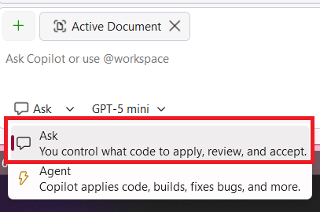

# Parte 03: Referenciando Arquivos de Código no Chat

Nesta seção, você aprenderá como referenciar arquivos de código existentes nas suas conversas no chat.

1. [] Abra o **Products.razor** novamente no projeto **Store**.
1. [] Certifique-se de que o GitHub Copilot Chat está aberto clicando no ícone do Github Copilot Chat no canto superior direito do Visual Studio e selecionando **Open Chat Window** ou pressionando `Ctrl+\+C` se o chat do Copilot não estiver aberto.

   

1. Mude o modo para `Ask`

	

1. Inicie um novo chat clicando no ícone `+` no canto superior direito da janela de chat.

   

1. [] Digite: `#ProductService.cs` para referenciar o arquivo ProductService.
1. [] Pergunte: `How would I implement getting and visualizing the products in a table using the code in #ProductService and the css required.`
1. [] Revise a sugestão de código, mas não a implemente ainda.
1. [] Observe como o Copilot pode referenciar código existente para fornecer sugestões contextuais.

**Conclusão Principal**: Referenciar arquivos no chat fornece ao Copilot o contexto necessário para dar sugestões mais precisas e específicas do projeto.

---

[Voltar: Parte 02 - Aprimorando a Interface com Inline Chat](./part02-enhancing-ui.md) | [Próximo: Parte 04 - Usando Instruções Personalizadas](./part04-custom-instructions.md)
