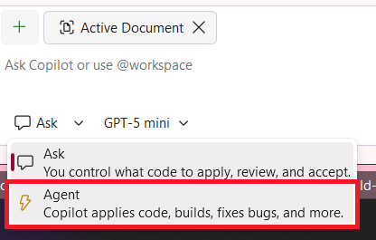
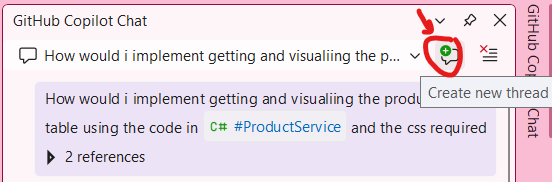
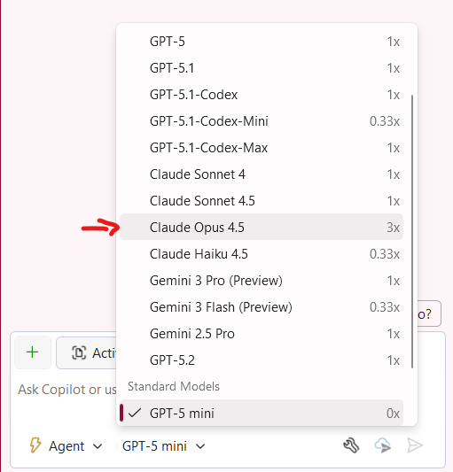

# Parte 05: Implementando Funcionalidades com o Agente Copilot

Anteriormente utilizamos o Copilot Chat, que é ótimo para trabalhar com um arquivo individual ou fazer perguntas sobre nosso código. No entanto, muitas atualizações exigem alterações em vários arquivos de uma base de código. Até mesmo uma mudança aparentemente simples em uma página web provavelmente requer atualizar arquivos HTML, CSS, Razor e C#. O Agente Copilot permite que você modifique vários arquivos de uma vez em todo o seu projeto, faz autocorreção e pode executar comandos se tiver permissão, como instalar pacotes NuGet.

Com o Agente Copilot, você adicionará os arquivos que precisam ser atualizados ao contexto. Depois que você fornecer o prompt, o Agente Copilot começará as atualizações em todos os arquivos no contexto. Ele também tem a capacidade de criar novos arquivos ou adicionar arquivos ao contexto conforme julgar apropriado.

Vamos adicionar a capacidade de ver uma lista de imagens no aplicativo:

1. [] Abra o GitHub Copilot Chat no canto superior direito do Visual Studio e selecione **Open Chat Window** ou pressione `Ctrl+\+C` se o chat do Copilot não estiver aberto.

1. [] Mude para o modo **Agent**.

   

1. [] No Visual Studio, abra um novo Copilot Chat com o ícone **+** do chat.

    

1. [] Na parte inferior do painel do GitHub Copilot Chat, selecione o modelo (o padrão é "GPT-4o") na lista suspensa e selecione **Claude Opus 4.5** na lista de modelos disponíveis.

    

1. [] Digite: `Implement a simple product listing page in Products.razor that fetches products from #ProductService and displays them in a simple list with product name, description, price, and image.`

    > NOTA: Você deve usar suas próprias palavras ao gerar o prompt. Como destacado anteriormente, parte do exercício é ficar confortável criando prompts para o GitHub Copilot. Uma dica importante: é sempre bom fornecer mais orientação para garantir que você obtenha o código que está procurando.

    > NOTA: Se for perguntado para **Enable Claude Opus 4.5 for all clients** clique no botão **Enable**.

O modo agente do Copilot começa a implementar as sugestões de código!

## Revisando as alterações

Ao contrário dos nossos exemplos anteriores em que trabalhamos com um arquivo individual, agora estamos trabalhando com alterações em vários arquivos — e talvez em várias seções de múltiplos arquivos. Felizmente, o Agente Copilot tem funcionalidades para ajudar a simplificar este processo.

O GitHub Copilot irá propor as seguintes alterações no aplicativo, incluindo a atualização do Products.razor e a adição de um Products.razor.css e possivelmente mais.

1. [] Revise as alterações de código do modo Agent

    O código deve ser semelhante ao seguinte:
    ```html
    <table class="table">
        <thead>
            <tr>
                <th>Image</th>
                <th>Name</th>
                <th>Description</th>
                <th>Price</th>
            </tr>
        </thead>
        <tbody>
            @foreach (var product in products)
            {
                <tr>
                    <td></td>
                    <td>@product.Name</td>
                    <td>@product.Description</td>
                    <td>@product.Price</td>
                </tr>
            }
        </tbody>
    </table>
    ```

    O **ProductService** deve ter sido injetado no topo do arquivo:
    ```html
    @inject ProductService ProductService
    ```

    O código deve ter sido atualizado na parte inferior do arquivo:
    ```cs
        @code {
        private List<Product>? products;
        private string imagePrefix = string.Empty;
    
        protected override async Task OnInitializedAsync()
        {
            // Simulate asynchronous loading to demonstrate streaming rendering
            await Task.Delay(500);
            imagePrefix = Configuration["ImagePrefix"]!;
            products = await ProductService.GetProducts();
        }
    }
    ```

1. [] Execute o aplicativo para ver sua nova página de listagem de produtos.

1. [] Pare a depuração e feche o aplicativo

**Conclusão Principal**: O Agente Copilot pode gerar implementações completas de funcionalidades com base em suas descrições em linguagem natural, economizando um tempo significativo de desenvolvimento.

---

[Voltar: Parte 04 - Usando Instruções Personalizadas](./part04-custom-instructions.md) | [Próximo: Parte 06 - Usando o Copilot Vision](./part06-copilot-vision.md)
