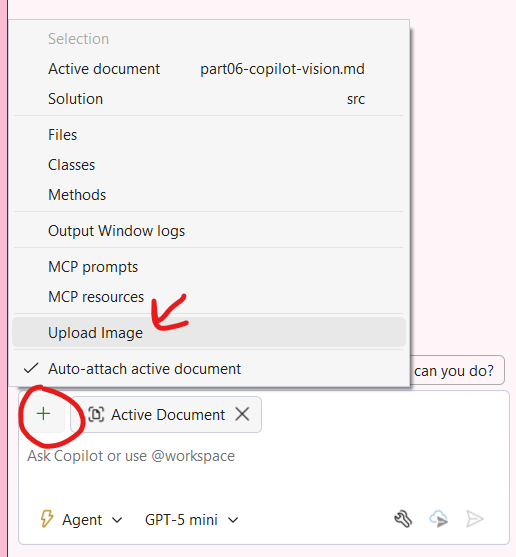

# Parte 06: Usando o Copilot Vision

Nesta seção, você usará o Copilot Vision. Você pode compartilhar capturas de tela de erros e o Copilot irá interpretar a imagem e resolver o problema. Ou compartilhe mockups de novos designs, e o Vision ajudará você a implementá-los. Vamos atualizar nosso design com base em uma foto que nosso designer nos forneceu.

1. [] Abra um novo thread do Copilot Chat no modo Agent.
1. [] Clique no botão **+** no chat, selecione **upload image** e selecione a imagem **eshop.png** encontrada na raiz do repositório clonado.

    

1. [] Pergunte: `Update the Products.razor to display products in a grid layout similar to this image. Add nice hover effects and make it responsive.`
1. [] Revise as alterações de código sugeridas e implemente-as. Devem ser recomendadas alterações tanto no **Products.razor** quanto em um novo **Products.razor.css**
1. [] Execute o aplicativo para ver o layout de grade de produtos atualizado. Pode ser necessário limpar o cache do navegador com CTRL+SHIFT+R se você não ver a atualização do CSS.

> [!NOTE]
> Continue interagindo com o Agente Copilot se o resultado não for do seu agrado.

**Conclusão Principal**: O Copilot Vision pode entender designs de UI a partir de imagens e ajudá-lo a implementá-los na sua aplicação.

---

[Voltar: Parte 05 - Implementando Funcionalidades com o Agente Copilot](./part05-implementing-features.md) | [Próximo: Parte 07 - Depurando com o Copilot](./part07-debugging-with-copilot.md)
