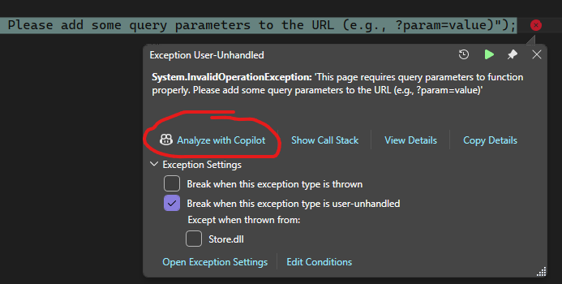
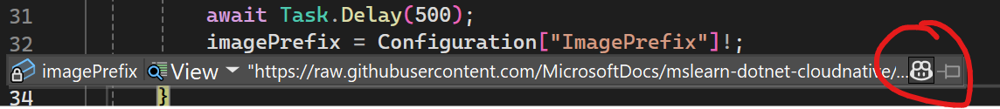
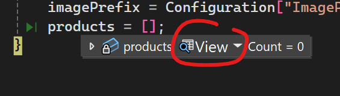
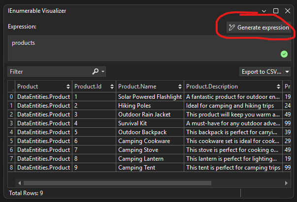

# Parte 07: Depurando com o Copilot

Nesta seção, você aprenderá como usar o Copilot para depurar uma exceção na sua aplicação.

1. [] Depure o projeto **AppHost** se ainda não estiver em execução e abra a **store** pelo painel do .NET Aspire.
1. [] Clique no botão **Go to About** no menu de navegação.
1. [] Observe que uma exceção ocorre e a aplicação trava.
1. [] Pressione a opção **Analyze with Copilot** no pop-up.

    

1. [] Observe como o Copilot traz informações do depurador, incluindo rastreamentos de pilha e estados de variáveis.
1. [] Note como o Copilot recomenda uma correção para o problema ou fornece sugestões de código para resolvê-lo.

**Conclusão Principal**: O Copilot pode ajudar a diagnosticar e corrigir exceções analisando informações do depurador e fornecendo recomendações práticas.

## Usando Janelas de Observação e Visualizadores

Nesta subseção, você aprenderá como usar o Copilot para analisar variáveis usando janelas de observação e visualizadores.

1. [] Abra o arquivo **Products.razor** novamente no projeto **Products**.
1. [] Adicione um ponto de interrupção no final do método **OnInitializedAsync**.
1. [] Depure o **TinyShop.AppHost** e abra a **store** pelo painel do .NET Aspire e navegue até a página **Products**.
1. [] Quando o ponto de interrupção for atingido, passe o mouse sobre a variável **imagePrefix**.
1. [] Pressione o botão **Copilot** para analisar a variável **imagePrefix**.

    

    >Nota: você também pode ver isso nas janelas Locals ou watch

1. [] Observe como o Copilot fornece informações detalhadas sobre a variável, incluindo seu valor e possíveis problemas.
1. [] Passe o mouse sobre a coleção **products** e clique no botão **View** com o ícone de lupa.

    

1. [] Use o visualizador para inspecionar o conteúdo da coleção **products**.
1. [] Clique no botão Generate expression e, em linguagem natural, digite: `Products that have the name outdoor in them and are under 40 dollars`
1. [] Observe como o Copilot gera a expressão apropriada automaticamente.

    

**Conclusão Principal**: O Copilot pode aprimorar a depuração fornecendo informações detalhadas sobre variáveis por meio de janelas de observação e visualizadores. O Copilot pode simplificar tarefas complexas de depuração gerando expressões e consultas LINQ com base em entrada em linguagem natural.

---

[Voltar: Parte 06 - Usando o Copilot Vision](./part06-copilot-vision.md) | [Próximo: Parte 08 - Descrições de Resumo de Commits](./part08-commit-summary-descriptions.md)
