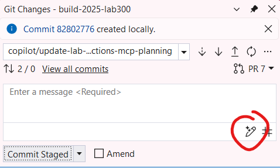
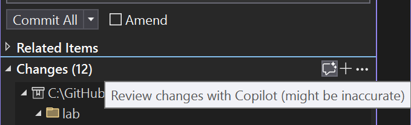

# Parte 08: Descrições de Resumo de Commits

Nesta seção, você aprenderá como usar o GitHub Copilot para gerar mensagens de commit e personalizá-las.

1. [] Abra a visualização **Git Changes** no Visual Studio (**View -> Git Changes**).
1. [] Selecione o botão de lápis com emoji de estrela para gerar automaticamente uma mensagem de commit usando o Copilot.

   
   
1. [] Navegue para **Tools -> Options -> GitHub -> Copilot -> Source Control Integration**.
1. [] Atualize a configuração de personalização da mensagem de commit para: `Summarize in a few sentences and then highlight the top 5 changes with emoji and short descriptions`
1. [] Volte à visualização **Git Changes** e gere uma nova mensagem de commit.
1. [] Observe como a nova mensagem de commit reflete a personalização atualizada.

**Conclusão Principal**: O Copilot pode ajudá-lo a criar mensagens de commit significativas e bem estruturadas, economizando tempo e melhorando a colaboração.

## Revisões de Código com o Copilot

1. [] Antes de enviar suas alterações, use o recurso **Code Review** para analisar seu código em busca de possíveis melhorias e sugestões.

   

1. [] Revise as sugestões fornecidas pelo Copilot e aplique as alterações necessárias, se houver.

**Conclusão Principal**: O recurso de Revisão de Código do Copilot pode ajudá-lo a identificar possíveis problemas e melhorar a qualidade do código antes da submissão.

---

[Voltar: Parte 07 - Depurando com o Copilot](./part07-debugging-with-copilot.md) | [Próximo: Parte 09 - Servidores MCP](./part09-mcp.md)
