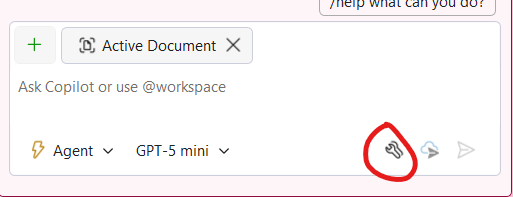
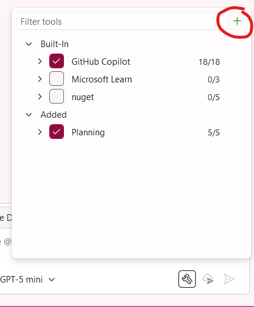
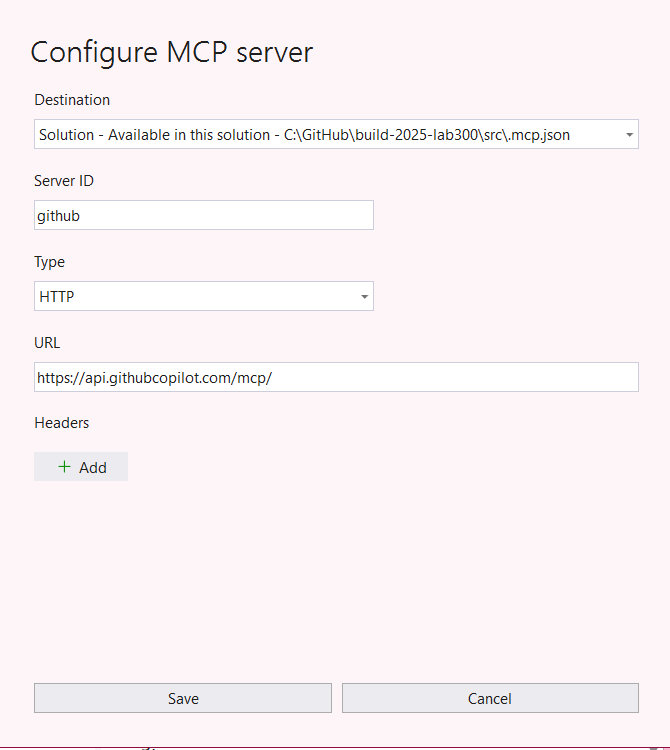
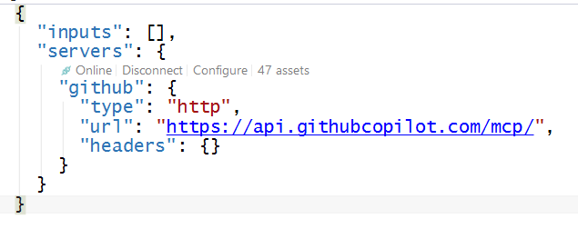
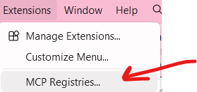
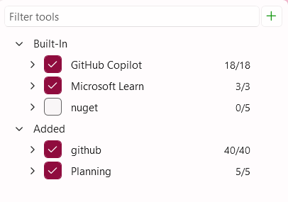

# Parte 09: Servidores MCP

O Model Context Protocol (MCP) é um protocolo aberto que padroniza como as aplicações fornecem contexto para grandes modelos de linguagem (LLMs). Os servidores MCP ampliam as capacidades do GitHub Copilot conectando-se a ferramentas e serviços externos, dando-lhe acesso a dados em tempo real e a capacidade de executar ações.

Nesta parte, você aprenderá como adicionar servidores MCP ao Visual Studio e usá-los para obter informações sobre como otimizar sua aplicação.

## Adicionando Servidores MCP da Galeria

O Visual Studio fornece uma galeria de servidores MCP pré-configurados que você pode facilmente adicionar ao seu projeto.

Para ver suas ferramentas e servidores MCP instalados:
1. [] Abra a janela do Copilot Chat clicando no ícone do GitHub Copilot e selecionando **Open Chat Window** ou pressionando `Ctrl+\+C`.
1. [] Clique no ícone **Tools** na parte inferior da janela de chat para abrir a configuração do servidor MCP.

   
1. As ferramentas integradas e dos servidores MCP aparecerão.
1. Clique no ícone **+** para adicionar um novo servidor MCP.
1. 
   
1. Especifique o seguinte
1. **Destination**: Solution
1. **Server Id**: `github`
1. **Type**: HTTP
1. **URL**: https://api.githubcopilot.com/mcp/

   

1. O GitHub MCP requer autenticação. No **Solution Explorer**, expanda **SolutionItems** e abra **.mcp.json**, e você verá uma mensagem de **Authentication required**. Clique nela e em Authenticate. Após isso você verá que está online e pronto para uso.
   

O Visual Studio 2026 tem uma galeria MCP integrada para ajudá-lo a instalar servidores MCP facilmente:

1. [] No Visual Studio 2026, vá para **Extensions -> MCP Registries...** para abrir a janela de gerenciamento de servidores MCP.
 
   

1. [] Navegue pelos servidores MCP existentes na galeria.

> [!TIP]
> Os servidores MCP podem fornecer acesso à documentação, APIs e outros serviços que podem ajudar o Copilot a fornecer respostas mais precisas e contextuais.

## Usando Servidores MCP para Obter Informações

Agora que você tem os servidores MCP do Microsoft Learn e do GitHub instalados, vamos usá-los para obter informações sobre como otimizar o carregamento de ativos na aplicação.

1. [] No Copilot Chat, mude para o modo **Agent**. 
1. [] Certifique-se de que o servidor MCP do Microsoft Learn está selecionado como uma ferramenta ativa. Se não o vir, clique em uma nova sessão de chat ou alterne os modos:
  
1. [] Digite o seguinte prompt: `Using the Microsoft Learn docs mcp, what are the best practices for optimizing image loading and asset delivery in a Blazor Server application?`
1. [] Revise a resposta do Copilot, que agora tem acesso à documentação mais recente da Microsoft através do servidor MCP.

## Criando Issues no GitHub com MCP

O servidor GitHub MCP permite que o Copilot interaja com seu repositório no GitHub. Vamos usá-lo para criar issues com melhorias que queremos fazer na aplicação.

1. [] Certifique-se de que o servidor GitHub MCP está selecionado como uma ferramenta ativa no Copilot Chat.
1. [] Na mesma sessão de chat, digite: `Based on the asset optimization recommendations, create 3 GitHub issues for improving the TinyShop application's performance.`

   > NOTA:
   > O Copilot usará o servidor GitHub MCP para criar as issues diretamente no seu repositório. Pode ser solicitado que você autorize a ação.

1. [] Revise as issues que o Copilot propõe criar.
1. [] Aprove a criação das issues quando solicitado.
1. [] Navegue até o seu repositório no GitHub para verificar se as issues foram criadas.

**Conclusão Principal**: Os servidores MCP ampliam as capacidades do GitHub Copilot conectando-o a serviços externos e documentação. Isso permite que o Copilot forneça informações mais precisas e atualizadas e execute ações como criar issues no GitHub diretamente da interface de chat.

---

[Voltar: Parte 08 - Descrições de Resumo de Commits](./part08-commit-summary-descriptions.md) | [Próximo: Parte 10 - Modo de Planejamento no Agente](./part10-planning-mode.md)
