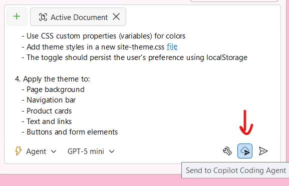
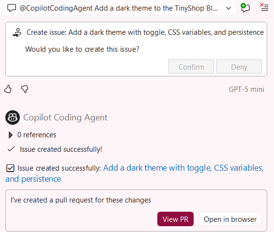

# Parte 12: Delegar para a Nuvem

Às vezes você tem uma ideia para uma funcionalidade ou melhoria que deseja implementar, mas não tem tempo para trabalhar nisso agora. O Agente na Nuvem do GitHub Copilot permite que você delegue tarefas para executar na nuvem, liberando você para se concentrar em outros trabalhos enquanto o Copilot implementa as alterações.

Nesta parte, você aprenderá como delegar uma tarefa para a nuvem para adicionar um tema escuro à aplicação TinyShop.

## Entendendo a Delegação para a Nuvem

O Agente na Nuvem permite que você:
- Envie tarefas complexas para execução na nuvem
- Continue trabalhando em outras tarefas enquanto o agente na nuvem implementa sua solicitação
- Revise e aplique as alterações quando a tarefa estiver concluída
- Receba notificações quando o trabalho estiver pronto

Isso é particularmente útil para:
- Grandes tarefas de refatoração
- Adição de novas funcionalidades que requerem alterações em vários arquivos
- Implementações demoradas que não precisam da sua atenção imediata

## Preparando sua Solicitação

Antes de delegar para a nuvem, é importante escrever um prompt claro e detalhado. O agente na nuvem não tem acesso ao seu contexto imediato, então seu prompt deve incluir todas as informações necessárias.

1. [] Pense na funcionalidade que você quer implementar. Para este laboratório, adicionaremos um tema escuro à aplicação TinyShop.

1. [] Considere quais detalhes o agente na nuvem precisará:
   - Quais cores o tema escuro deve usar?
   - Deve incluir um botão para os usuários alternarem entre temas?
   - Onde os estilos do tema devem ser colocados?
   - A preferência de tema deve ser persistida?

## Delegando para a Nuvem

1. [] Abra o Copilot Chat e mude para o modo **Agent**.


1. [] Insira um prompt detalhado para a funcionalidade de tema escuro:

   ```
   Add a dark theme to the TinyShop Blazor application with the following requirements:

   1. Create a dark color scheme:
      - Background: #1a1a2e
      - Secondary background: #16213e
      - Text: #eaeaea
      - Accent: #0f3460
      - Highlight: #e94560

   2. Add a theme toggle:
      - Place a sun/moon icon button in the navigation bar
      - Clicking it should switch between light and dark themes
      - Use smooth CSS transitions for the theme switch

   3. Implementation details:
      - Use CSS custom properties (variables) for colors
      - Add theme styles in a new site-theme.css file
      - The toggle should persist the user's preference using localStorage

   4. Apply the theme to:
      - Page background
      - Navigation bar
      - Product cards
      - Text and links
      - Buttons and form elements
   ```

1. [] Revise o prompt para garantir que inclui todos os detalhes necessários.
1. [] Clique no botão **Send to Copilot Coding Agent** (ícone de nuvem) na parte inferior da janela de chat.

   
1. O agente na nuvem reconhecerá a solicitação e começará a processá-la.
1. [] Você será solicitado a confirmar a delegação e criar uma issue. Clique em **Confirm** para prosseguir.
1. [] Após a issue ser criada, você poderá ver o pull request para as alterações no Visual Studio ou no GitHub.
  

1. Ao visualizar no GitHub, você pode ver as alterações propostas no pull request e visualizar a sessão para acompanhar em tempo real.


## Enquanto a Tarefa Está em Execução

Após o envio, você verá uma confirmação de que sua tarefa foi delegada. Você pode:

1. [] Continuar trabalhando em outras tarefas no Visual Studio.
1. [] Verificar o status da sua tarefa na nuvem na janela do pull request.
1. [] Receber uma notificação quando a tarefa estiver concluída.

> [!TIP]
> As tarefas do Agente na Nuvem geralmente levam vários minutos para serem concluídas, dependendo da complexidade da solicitação.


## Testando o Tema Escuro

1. [] Assim que o agente na nuvem tiver concluído a tarefa, revise as alterações no pull request e faça o checkout do branch onde as alterações foram feitas.
1. [] Execute o aplicativo com F5 ou Debug -> Start Debugging.
1. [] Clique no botão de alternância de tema na barra de navegação.
1. [] Verifique se o tema escuro é aplicado corretamente.
1. [] Atualize a página e verifique se a preferência de tema é mantida.
1. [] Mude de volta para o tema claro e verifique se funciona nos dois sentidos.

**Conclusão Principal**: Delegar para a Nuvem permite que você transfira tarefas complexas para o GitHub Copilot enquanto se concentra em outros trabalhos. Isso é especialmente valioso para implementações demoradas ou quando você quer explorar ideias sem bloquear seu fluxo de trabalho imediato.

---

🎉 **Parabéns!** Você completou todas as 13 partes do workshop!

[Voltar: Parte 11 - Arquivos de Prompt Reutilizáveis](./part11-reusable-prompts.md) | [🎊 Workshop Concluído!](complete.html)
