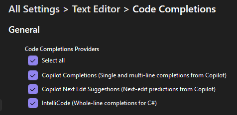

# Configuração do Workshop

Para completar este workshop você precisará do Visual Studio 2026, do .NET 10 SDK e de uma conta no GitHub com acesso ao GitHub Copilot.

## Pré-requisitos

Antes de começar, certifique-se de ter:

- **Visual Studio 2026** com a extensão GitHub Copilot instalada
- **.NET 10 SDK** instalado
- **Conta no GitHub** com uma das seguintes opções:
  - [GitHub Copilot Free](https://github.com/features/copilot) - Versão gratuita com uso limitado
  - [GitHub Copilot Pro](https://github.com/features/copilot) - Acesso completo (teste gratuito de 30 dias disponível)
  - GitHub Copilot através da sua organização

> [!TIP]
> Se você ainda não tem o GitHub Copilot, pode [se inscrever no Copilot Free](https://github.com/features/copilot) ou iniciar um [teste gratuito do Copilot Pro](https://github.com/github-copilot/signup).

## Instalar a Extensão .github + MCP

Antes de começarmos, vamos instalar a extensão .github + MCP para o Visual Studio. Esta extensão fornece acesso aos servidores GitHub MCP que usaremos mais adiante no laboratório.

1. [] Abra o Visual Studio 2026
1. [] Vá em **Extensions -> Manage Extensions**
1. [] Pesquise por **.github + MCP** na caixa de pesquisa
1. [] Clique em **Install** na extensão **.github + MCP** de Mads Kristensen
1. [] Reinicie o Visual Studio se solicitado

> [!TIP]
> Você também pode instalar esta extensão pelo [Visual Studio Marketplace](https://marketplace.visualstudio.com/items?itemName=MadsKristensen.GitHubNode). A extensão .github + MCP é importante pois fornece o runtime Node.js necessário para alguns servidores MCP, que você usará na Parte 9 deste laboratório.

## Entrar no GitHub Copilot

1. [] Abra seu navegador e acesse `https://github.com`.
1. [] Entre com sua conta do GitHub ou crie uma nova conta caso não tenha.
1. [] Abra o Visual Studio 2026.
1. [] Selecione **Continue without code**. Se solicitado para entrar, você pode clicar em Fechar.
1. [] Clique no ícone do Copilot na barra superior (lado esquerdo, ao lado da caixa de pesquisa).
1. [] Clique em **Sign in to use Copilot**.
1. [] Uma janela do navegador será aberta pedindo para você entrar no GitHub e autorizar o Visual Studio e o Copilot. Conclua o login e clique em **Authorize** quando solicitado.
1. [] Quando o navegador mostrar a confirmação, clique em **Open** para retornar ao Visual Studio.
1. [] Após a configuração, você deverá ver a aba **GitHub Copilot Walkthrough** e o botão do Copilot deverá estar verde.

> [!NOTE]
> Para os exercícios práticos que criam ou modificam dados do repositório via agentes na nuvem (Parte 12), você precisará fazer um fork do repositório do laboratório na sua própria conta. Isso dá ao agente na nuvem permissões para operar no seu fork.

## Ativar Configurações do Copilot

1. [] Certifique-se de que as Completações de Código e as Sugestões de Próxima Edição estão ativadas:
   - Vá às configurações de Completações de Código no Visual Studio em **Tools -> Options -> Text Editor -> Code Completions**
   - Certifique-se de que **Copilot Completions** está marcado.
   - Certifique-se de que **Copilot Next Edit Suggestions** está marcado.

   

1. [] Vá para **Tools -> Options -> GitHub -> Copilot -> Copilot Chat** e certifique-se de que as seguintes configurações estão ativadas:
   - **Enable Planning**
   - **Enable View Plan Execution**
   - **Enable Copilot Coding agent (Preview)**

## Clonar o Repositório do Laboratório

Para a experiência completa — especialmente se você planeja delegar tarefas a agentes na nuvem ou permitir que o Copilot crie issues e envie alterações — faça um fork do repositório para sua própria conta no GitHub e clone o seu fork.

1. [] No seu navegador, acesse `https://github.com/carlosmachel/visual-studio-github-copilot-lab` e clique em **Fork** para criar um fork na sua conta do GitHub.
1. [] No Visual Studio, clique em **File -> Clone Repository**.
1. [] Insira a URL do seu fork (por exemplo `https://github.com/<seu-usuario>/visual-studio-github-copilot-lab`) e pressione **Clone**.

Se preferir não fazer um fork, você ainda pode clonar o repositório original diretamente:

1. [] No Visual Studio, clique em **File -> Clone Repository**.
1. [] Insira `https://github.com/carlosmachel/visual-studio-github-copilot-lab` e pressione **Clone**.

O código agora está aberto no Visual Studio. Fique à vontade para explorá-lo ou pule para a próxima seção para iniciar o aplicativo.

## Iniciar o Aplicativo

1. [] Abra o **Solution Explorer** pelo menu **View -> Solution Explorer**.
1. [] Defina o **TinyShop.AppHost** como projeto de inicialização, se ainda não estiver, clicando com o botão direito em **TinyShop.AppHost** e selecionando **Set as Startup Project**. Inicie o projeto com F5 ou **Debug -> Start Debugging** no menu.

    O .NET Aspire AppHost iniciará dois aplicativos e o .NET Aspire Dashboard:

    - O aplicativo .NET backend em **https://localhost:7130/api/Product**
    - O aplicativo Blazor frontend em **https://localhost:7085** - Você pode ver o aplicativo abrindo essa URL a partir do painel

1. [] Pare a depuração e feche o aplicativo.

## Resumo e Próximos Passos

Você configurou seu ambiente e clonou o repositório que usará durante todo o workshop. Vamos começar a explorar o GitHub Copilot!

---

[Próximo: Parte 00 - Explorando o Código](./part00-exploring-codebase.md)
